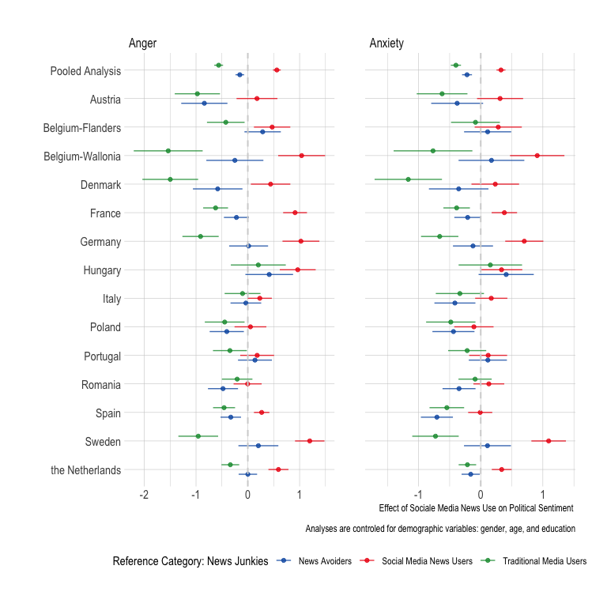
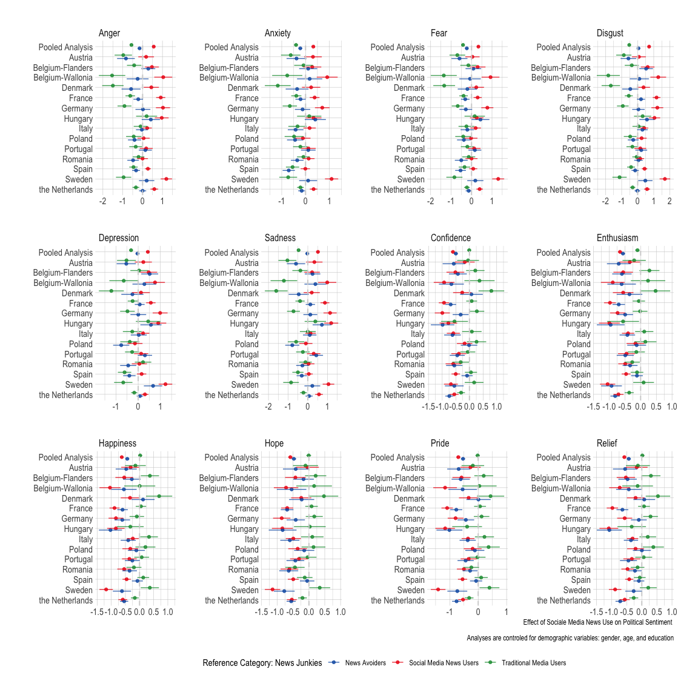
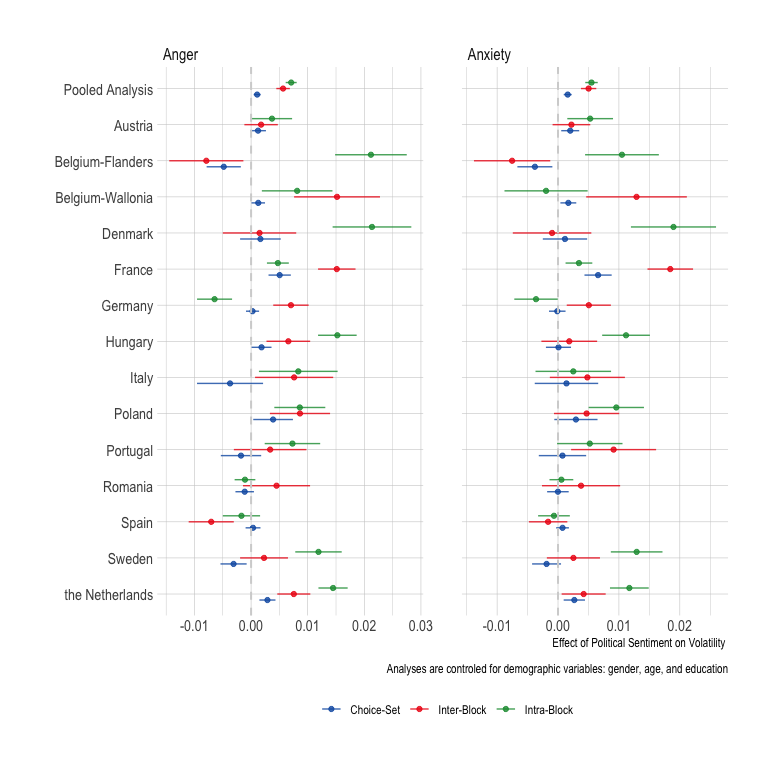
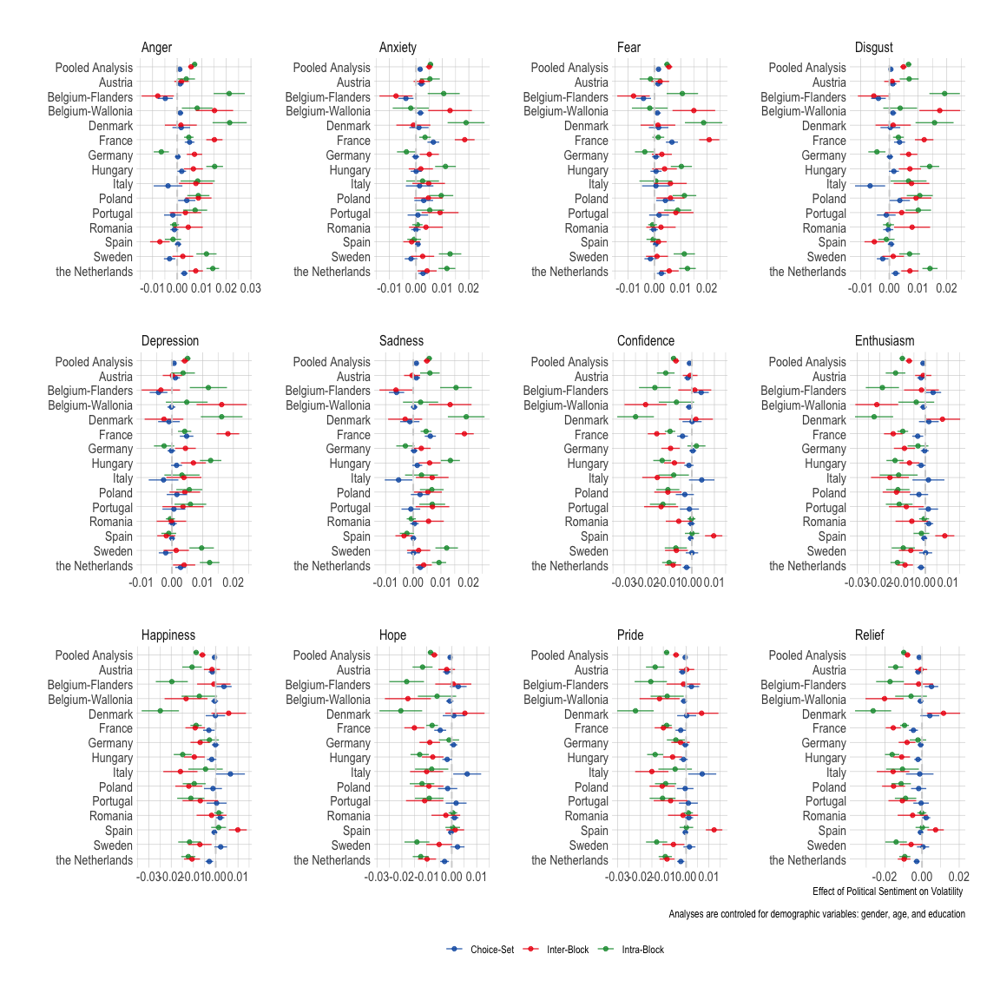

Analyses - S1
================

- [Required Packages &
  Reproducibility](#required-packages--reproducibility)
- [Testen Hypothesen](#testen-hypothesen)
  - [regressies](#regressies)

## Required Packages & Reproducibility

``` r
rm(list=ls())
source(here::here("src/lib/functions.R"))
#renv::snapshot()
```

``` r
load(here("data/intermediate/cleaned_eves.RData"))
```

# Testen Hypothesen

## regressies

H1: Y = woede/angst, X = sm gebruik

``` r
source(here("src/analysis/h1-s1.R"))
h1_2 #effect of social media use on anxiety/anger
```



``` r
#kableExtra::kbl(h1a)
#kableExtra::kbl(h1b)
```

``` r
h1#effect of social media use on all emotions
```



``` r
rm(h1, h1_2, h1a, h1b, h1c, h1d, h1e, h1f, h1g, h1h, h1i, h1j, h1k, h1l, tmp)
```

H2: Y = volatiliteit, x = woede/angst

``` r
source(here("src/analysis/h2-s1.R"))
h2_1 #effect van angst/woede op volatiliteit
```



``` r
#kableExtra::kbl(h2a)
#kableExtra::kbl(h2b)
```

``` r
h2#effect of  all emotions on volatillity
```



``` r
rm(h2, h2_1, h2a, h2b, h2c, h2d, h2e, h2f, h2g, h2h, h2i, h2j, h2k, h2l, tmp)
```
