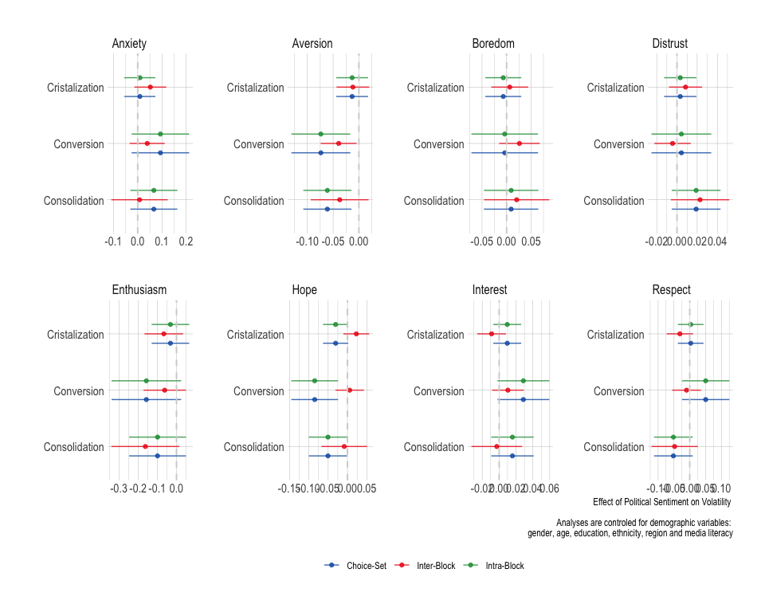

Analyses - S2
================

- [Required Packages &
  Reproducibility](#required-packages--reproducibility)
- [Testen Hypothesen](#testen-hypothesen)
  - [regressies](#regressies)

## Required Packages & Reproducibility

``` r
rm(list=ls())
source(here::here("src/lib/functions.R"))
#renv::snapshot()
```

``` r
load(here("data/intermediate/cleaned_data_allwaves.RData"))
```

# Testen Hypothesen

## regressies

H1: Y = woede/angst, X = sm gebruik

``` r
source(here("src/analysis/h1_s2.R"))
h1 #effect van social media use op angst/woede
```


``` r
#source(here("src/analysis/explor_h1_s2.R"))
#h1a_e #effect van social media use op angst gemodereerd door mediageletterdheid
#h1b_e #effect van social media use op woede gemodereerd door mediageletterdheid
#h1c_e #effect van social media use op angst gemodereerd door uur op social media#h1d_e #effect van social media use op woede gemodereerd door uur op social media

#kableExtra::kbl(h1a)
#kableExtra::kbl(h1b)

rm(dm, h1, h1a, h1b, tmp)
#rm(h1c, h1d, h1a_e, h1b_e, h1c_e, h1d_e, tmp)
```

H2: Y = volatiliteit, x = woede/angst

``` r
source(here("src/analysis/h2_s2.R"))
h2 #effect van angst/woede op volatiliteit
```



``` r
#kableExtra::kbl(h2a)
#kableExtra::kbl(h2b)
```
