Prepare Data
================

- <a href="#required-packages--reproducibility"
  id="toc-required-packages--reproducibility">Required Packages &amp;
  Reproducibility</a>
- <a href="#tidy-data" id="toc-tidy-data">Tidy Data</a>
- <a href="#constructie-van-variabelen"
  id="toc-constructie-van-variabelen">Constructie van variabelen</a>
  - <a href="#data" id="toc-data">Data</a>
  - <a href="#sociale-media-gebruik-i1_5"
    id="toc-sociale-media-gebruik-i1_5">Sociale Media gebruik (I1_5)</a>
  - <a href="#emoties" id="toc-emoties">Emoties</a>
  - <a href="#volatileit" id="toc-volatileit">Volatileit</a>
- <a href="#data-beschrijving" id="toc-data-beschrijving">Data
  Beschrijving</a>
  - <a href="#sociale-media-gebruik" id="toc-sociale-media-gebruik">Sociale
    Media gebruik</a>
  - <a href="#emoties-1" id="toc-emoties-1">Emoties</a>
  - <a href="#volatiliteit" id="toc-volatiliteit">Volatiliteit</a>
- <a href="#testen-hypothesen" id="toc-testen-hypothesen">Testen
  Hypothesen</a>
  - <a href="#regressies" id="toc-regressies">regressies</a>

## Required Packages & Reproducibility

``` r
rm(list=ls())
source(here::here("src/lib/functions.R"))
#renv::snapshot()
```

## Tidy Data

``` r
source(here("src/data-processing/get_data.R"))
```

# Constructie van variabelen

## Data

Filter data op mensen die 3 of meer keer hebben meegedaan

``` r
n <- d %>% 
  group_by(id) %>% 
  count() %>% 
  filter(n>=3 & n<6) %>% 
  ungroup() 

d <- left_join(n, d, by = "id") %>% 
  select(-n)
```

## Sociale Media gebruik (I1_5)

categorien maken:

1.  social media hoger dan gemiddeld & andere media hoger dan gemiddeld,
    (news junkies)
2.  social media hoger dan gemiddeld & andere lager dan gemiddeld,
    (categorie waar we geintereerd in zijn)
3.  social media lager dan gemiddeld (mediaan) & andere media hoger dan
    gemiddeld
4.  social media lager dan gemiddeld (mediaan) & andere lager dan
    gemiddeld (news avoiders)

## Emoties

1.  Angst (0/1)
2.  Woede = of Afschuw of Wantrouwen (0/1)

## Volatileit

Typen:

1.  Conversie-inter: verandering van stemintentie in w1-w4 (veranderen
    gedurende campage) tussen de “blokken”
2.  Conversie-intra: verandering van stemintentie in w1-w4 (veranderen
    gedurende campage) binnen het “blok”
3.  Conversie-choiceset: verandering van stemintentie in w1-w4
    (veranderen gedurende campage) binnen de choice set obv PTV
4.  Kristalisatie-inter: veranderen van laatste stemintentie tov
    stemkeuze (w5) tussen de “blokken”
5.  Kristalisatie-intra: veranderen van laatste stemintentie tov
    stemkeuze (w5) binnen het “blok”
6.  Kristalisatie-choiceset: veranderen van laatste stemintentie tov
    stemkeuze (w5) binnen de choice set obv PTV
7.  Versteviging-inter: verandering stemkeuze TK21 naar stemkeuze w5
    tussen de “blokken”
8.  Versteviging-intra: verandering stemkeuze TK21 naar stemkeuze w5
    binnen het “blok”
9.  Versteviging-choiceset: verandering stemkeuze TK21 naar stemkeuze w5
    binnen de choice set obv PTV

``` r
source(here("src/data-processing/operationalization.R"))
save(df, file = here("data/intermediate/cleaned_data_allwaves.RData"))
```

# Data Beschrijving

## Sociale Media gebruik

welke mensen zitten in categorie?

``` r
source(here("src/data-processing/descr_sm.R"))
p1 #demografisch profiel obv SM consumptie
```

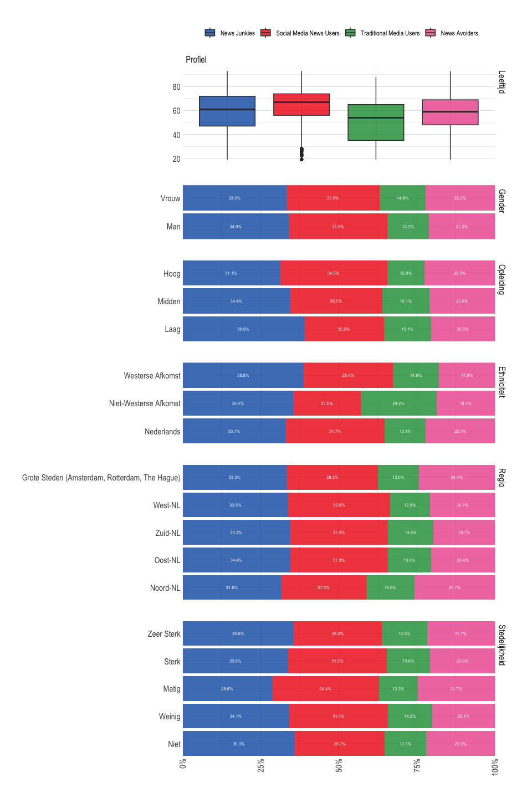

``` r
p2 #profiel poltieke achtergrond
```

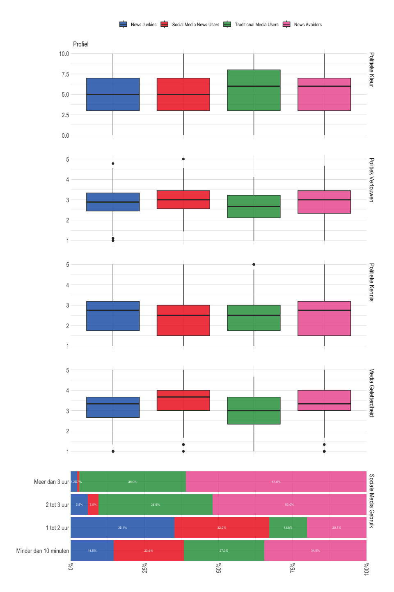

``` r
rm(tmp)
```

## Emoties

welke mensen ervaren welk politiek sentiment?

``` r
source(here("src/data-processing/descr_emotion.R"))
p1 #demografisch profiel obv angst 
```

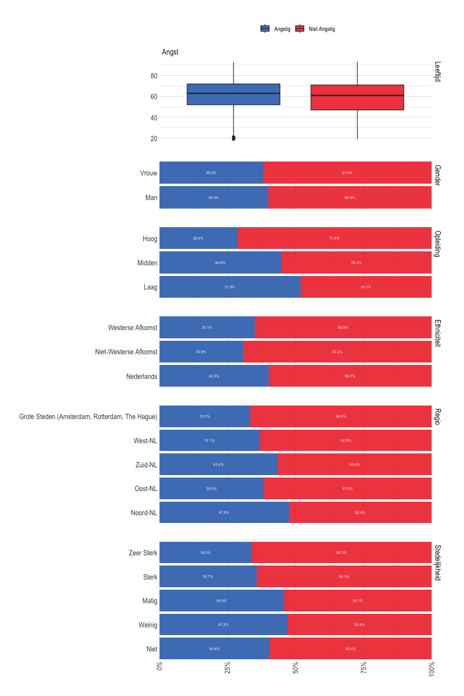

``` r
p2 #profiel poltieke achtergrond obv angst
```

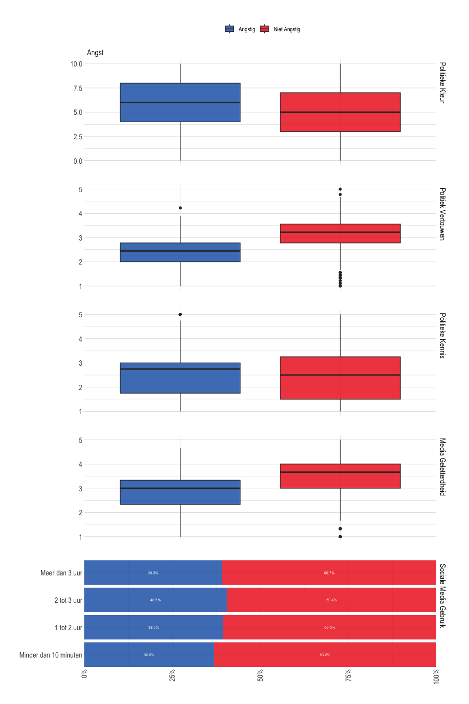

``` r
p3 #demografisch profiel obv woede 
```

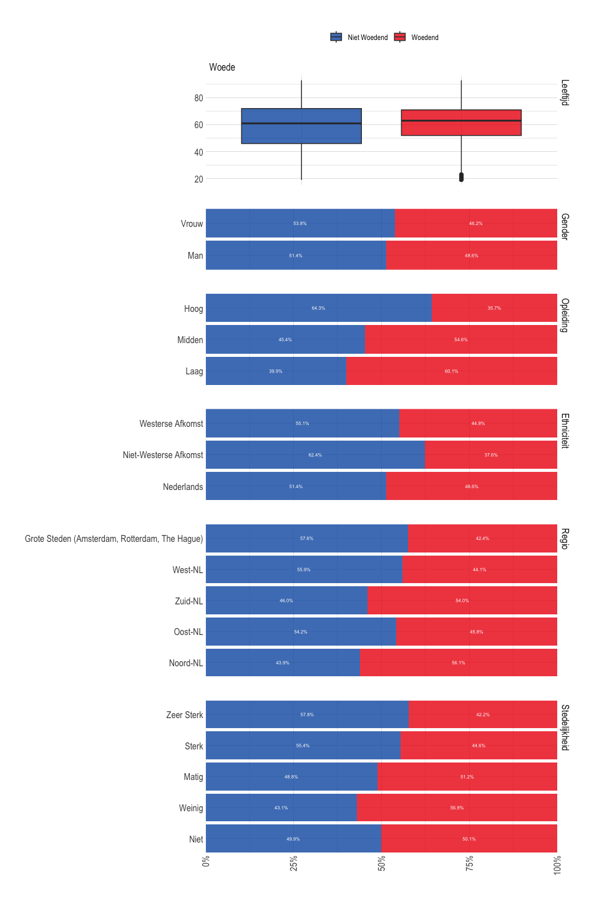

``` r
p4 #profiel poltieke achtergrond obv woede
```

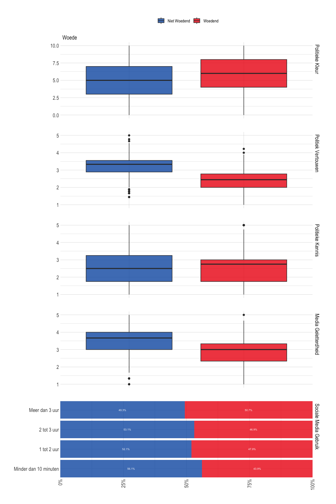

``` r
rm(tmp)
```

## Volatiliteit

welke mensen zitten in categorie?

- voor alle type volatiliteit geldt dat binnen choice-set overlapt met
  of intra-blok of inter-blok

``` r
source(here("src/data-processing/descr_vol.R"))
p1 #demografisch profiel obv conversie 
```

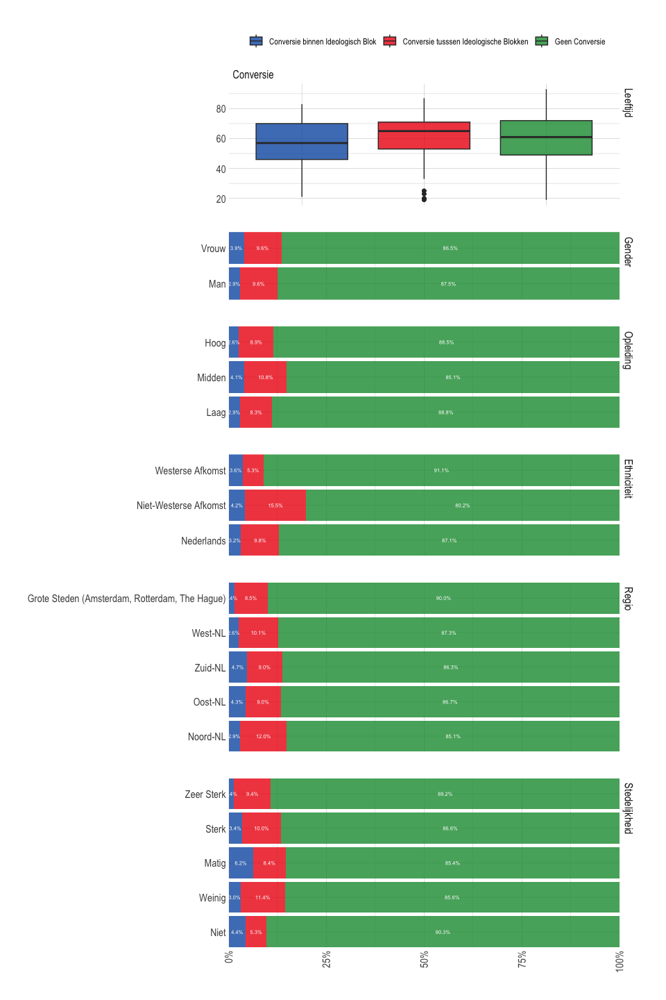

``` r
p2 #profiel poltieke achtergrond obv conversie
```

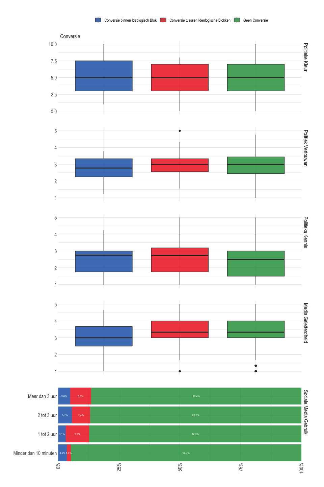

``` r
p3 #profiel poltieke achtergrond obv kristalisatie
```

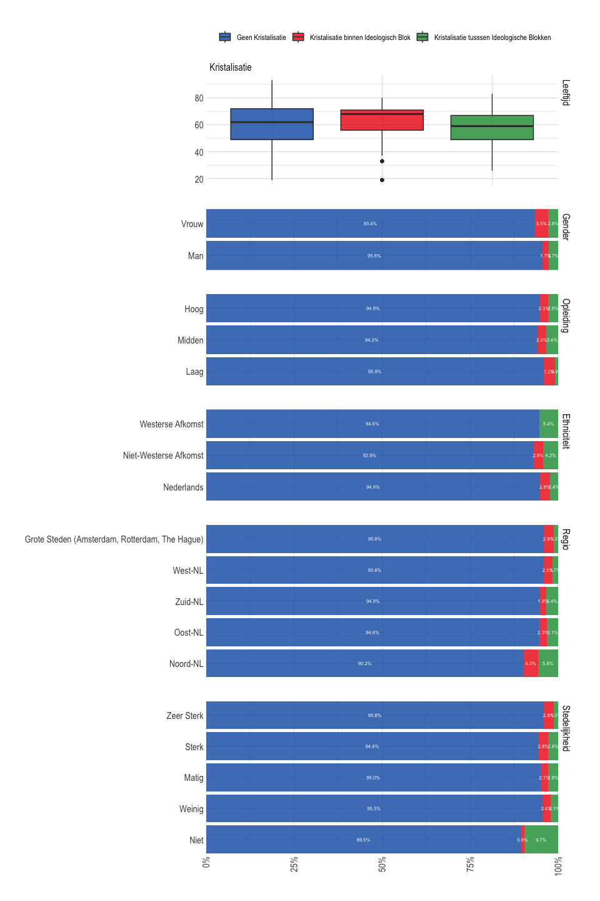

``` r
p4 #profiel poltieke achtergrond obv kristalisatie
```

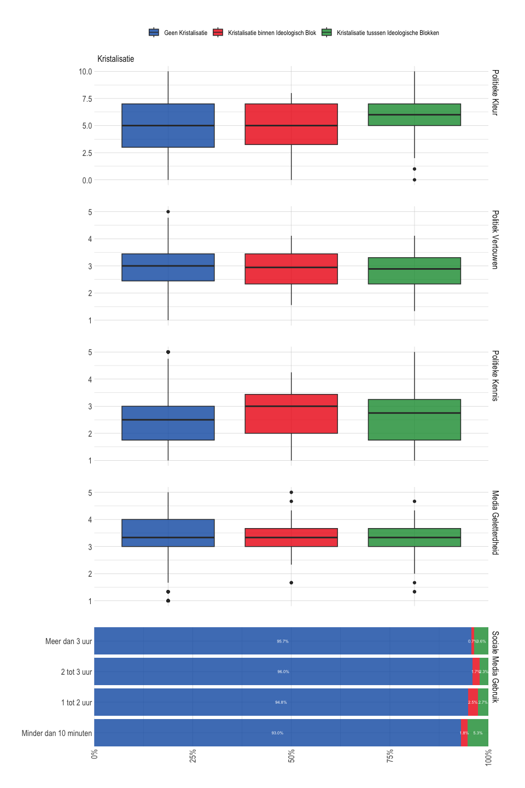

``` r
p5 #profiel poltieke achtergrond obv versteviging
```

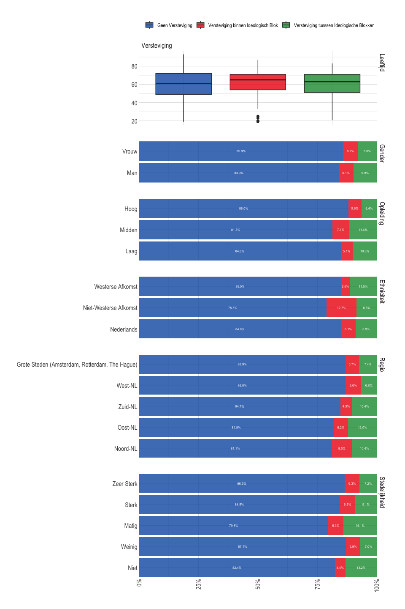

``` r
p6 #profiel poltieke achtergrond obv versteviging
```

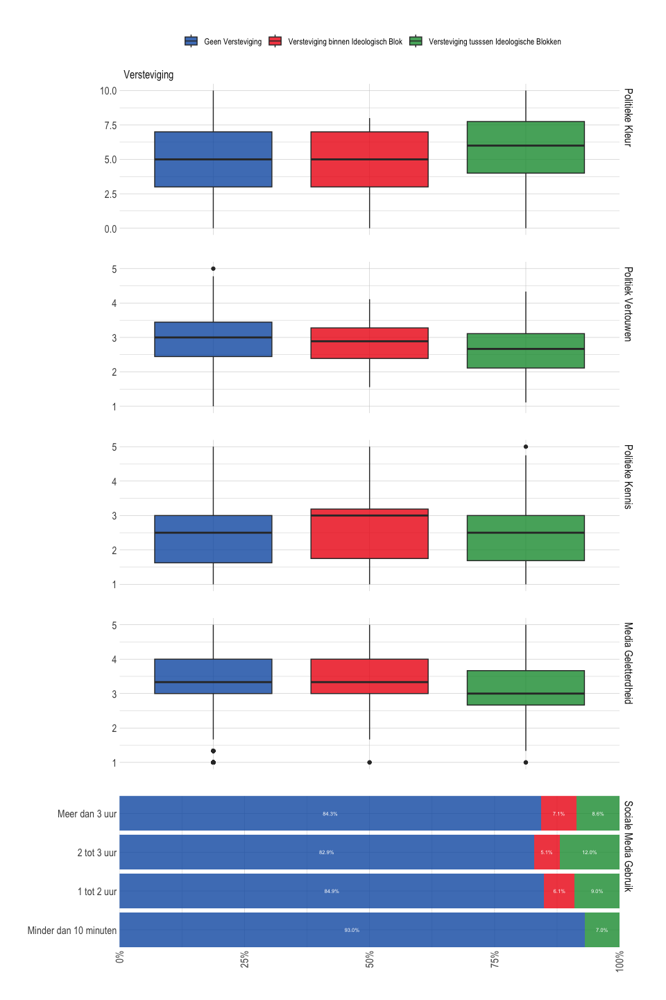

``` r
rm(tmp)
```

# Testen Hypothesen

## regressies

H1: Y = woede/angst, X = sm gebruik

- dynamisch: als je meer sociale media gaat gebruiken, heb je dan een
  hogere kans om angst te raporteren
- statisch: voor iedere wave regressie sm gebruik op woede/angst

H2: Y = volatiliteit, x = woede/angst

- nadenken over hoe we dit precies testen (Mariken): gaat het om %
  woede/angst te noemen in W_n of om totaal gerapporteerde woede in w5?

H3: mediatie: sociale media op emotie op volatiliteit

- use SEM (lavaan) or multilevel frameworks (lme4). You can set up the
  different paths just as you would normally, but account for stability
  in within-person variance
- Use random-effect within-between model
