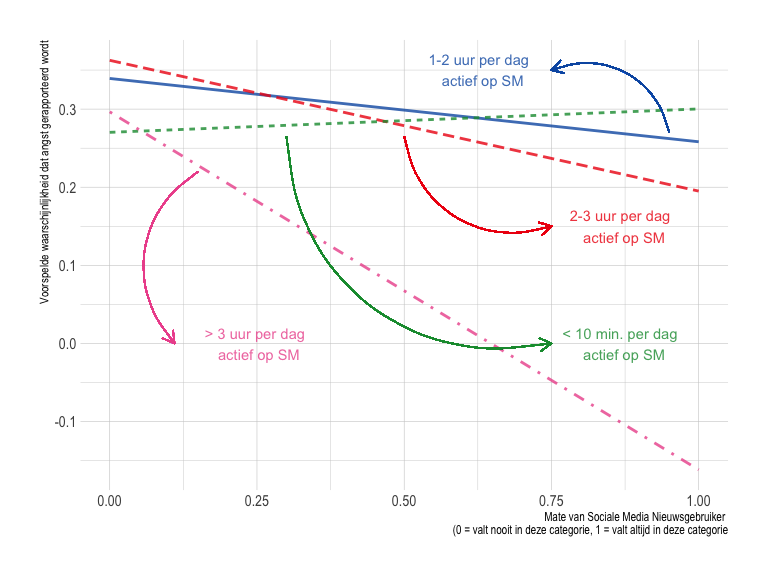

Prepare Data
================

- <a href="#required-packages--reproducibility"
  id="toc-required-packages--reproducibility">Required Packages &amp;
  Reproducibility</a>
- <a href="#tidy-data" id="toc-tidy-data">Tidy Data</a>
- <a href="#constructie-van-variabelen"
  id="toc-constructie-van-variabelen">Constructie van variabelen</a>
  - <a href="#data" id="toc-data">Data</a>
  - <a href="#sociale-media-gebruik-i1_5"
    id="toc-sociale-media-gebruik-i1_5">Sociale Media gebruik (I1_5)</a>
  - <a href="#emoties" id="toc-emoties">Emoties</a>
  - <a href="#volatileit" id="toc-volatileit">Volatileit</a>
- <a href="#data-beschrijving" id="toc-data-beschrijving">Data
  Beschrijving</a>
  - <a href="#sociale-media-gebruik" id="toc-sociale-media-gebruik">Sociale
    Media gebruik</a>
  - <a href="#emoties-1" id="toc-emoties-1">Emoties</a>
  - <a href="#volatiliteit" id="toc-volatiliteit">Volatiliteit</a>
- <a href="#testen-hypothesen" id="toc-testen-hypothesen">Testen
  Hypothesen</a>
  - <a href="#regressies" id="toc-regressies">regressies</a>

## Required Packages & Reproducibility

``` r
rm(list=ls())
source(here::here("src/lib/functions.R"))
#renv::snapshot()
```

## Tidy Data

``` r
source(here("src/data-processing/get_data.R"))
```

# Constructie van variabelen

## Data

Filter data op mensen die 3 of meer keer hebben meegedaan

``` r
n <- d %>% 
  group_by(id) %>% 
  count() %>% 
  filter(n>=3 & n<6) %>% 
  ungroup() 

d <- left_join(n, d, by = "id") %>% 
  select(-n)
```

## Sociale Media gebruik (I1_5)

categorien maken:

1.  social media hoger dan gemiddeld & andere media hoger dan gemiddeld,
    (news junkies)
2.  social media hoger dan gemiddeld & andere lager dan gemiddeld,
    (categorie waar we geintereerd in zijn)
3.  social media lager dan gemiddeld (mediaan) & andere media hoger dan
    gemiddeld
4.  social media lager dan gemiddeld (mediaan) & andere lager dan
    gemiddeld (news avoiders)

## Emoties

1.  Angst (0/1)
2.  Woede = of Afschuw of Wantrouwen (0/1)

## Volatileit

Typen:

1.  Conversie-inter: verandering van stemintentie in w1-w4 (veranderen
    gedurende campage) tussen de “blokken”
2.  Conversie-intra: verandering van stemintentie in w1-w4 (veranderen
    gedurende campage) binnen het “blok”
3.  Conversie-choiceset: verandering van stemintentie in w1-w4
    (veranderen gedurende campage) binnen de choice set obv PTV
4.  Kristalisatie-inter: veranderen van laatste stemintentie tov
    stemkeuze (w5) tussen de “blokken”
5.  Kristalisatie-intra: veranderen van laatste stemintentie tov
    stemkeuze (w5) binnen het “blok”
6.  Kristalisatie-choiceset: veranderen van laatste stemintentie tov
    stemkeuze (w5) binnen de choice set obv PTV
7.  Versteviging-inter: verandering stemkeuze TK21 naar stemkeuze w5
    tussen de “blokken”
8.  Versteviging-intra: verandering stemkeuze TK21 naar stemkeuze w5
    binnen het “blok”
9.  Versteviging-choiceset: verandering stemkeuze TK21 naar stemkeuze w5
    binnen de choice set obv PTV

``` r
source(here("src/data-processing/operationalization.R"))
save(df, file = here("data/intermediate/cleaned_data_allwaves.RData"))
```

# Data Beschrijving

## Sociale Media gebruik

welke mensen zitten in categorie?

``` r
source(here("src/data-processing/descr_sm.R"))
p1 #demografisch profiel obv SM consumptie
```


``` r
p2 #profiel poltieke achtergrond
```


``` r
rm(tmp)
```

## Emoties

welke mensen ervaren welk politiek sentiment?

``` r
source(here("src/data-processing/descr_emotion.R"))
p1 #demografisch profiel obv angst 
```


``` r
p2 #profiel poltieke achtergrond obv angst
```


``` r
p3 #demografisch profiel obv woede 
```


``` r
p4 #profiel poltieke achtergrond obv woede
```


``` r
p1b #demografisch profiel obv angst (relatief)
```


``` r
p2b #profiel poltieke achtergrond obv angst (relatief)
```


``` r
p3b #demografisch profiel obv woede (relatief)
```


``` r
p4b #profiel poltieke achtergrond obv woede (relatief)
```


``` r
rm(tmp)
```

## Volatiliteit

welke mensen zitten in categorie?

- voor alle type volatiliteit geldt dat binnen choice-set overlapt met
  of intra-blok of inter-blok

``` r
source(here("src/data-processing/descr_vol.R"))
p1 #demografisch profiel obv conversie 
```


``` r
p2 #profiel poltieke achtergrond obv conversie
```


``` r
p3 #profiel poltieke achtergrond obv kristalisatie
```


``` r
p4 #profiel poltieke achtergrond obv kristalisatie
```


``` r
p5 #profiel poltieke achtergrond obv versteviging
```


``` r
p6 #profiel poltieke achtergrond obv versteviging
```


``` r
p1b #demografisch profiel obv conversie (choice set)
```


``` r
p2b #profiel poltieke achtergrond obv conversie (choice set)
```


``` r
p3b #profiel poltieke achtergrond obv kristalisatie (choice set)
```


``` r
p4b #profiel poltieke achtergrond obv kristalisatie (choice set)
```


``` r
p5b #profiel poltieke achtergrond obv versteviging (choice set)
```


``` r
p6b #profiel poltieke achtergrond obv versteviging (choice set)
```


``` r
rm(tmp)
```

# Testen Hypothesen

## regressies

H1: Y = woede/angst, X = sm gebruik

- Sociale media gebruik is gemeten door te kijken hoe vaak de respondent
  in het aantal waves dat zij meedoet in de categorie social media hoger
  dan gemiddeld & andere media lager dan gemiddeld valt. `0` betekent
  dat de respondent daar nooit invalt, `1` betekent dat de respondent
  daar iedere keer dat zij meedoet invalt, `0.25` betekent dat ze daar
  een van de vier kere in die categorie valt.
- Angst en woede zijn op een zelfde manier gemeten
- Model: OLS regressie -\> geen sterke causale test!
- De regressieanalyse laat zien hoe meer sociale media mensen gbruken
  voor politiek nieuws, hoe kleiner de kans is dat ze woede/angst
  rapporteren. Beide effecten zijn statistisch significant.
- exploratieve moderaties met mediageletterdheid en aantal uur actief op
  SM laten zien dat deze variabelen de richting van het effect niet
  veranderen.

``` r
source(here("src/analysis/h1.R"))
h1 #effect van social media use op angst/woede
```


``` r
h1a_e #effect van social media use op angst gemodereerd door mediageletterdheid
```


``` r
h1b_e #effect van social media use op woede gemodereerd door mediageletterdheid
```


``` r
h1c_e #effect van social media use op angst gemodereerd door uur op social media
```



``` r
h1d_e #effect van social media use op woede gemodereerd door uur op social media
```


``` r
rm(dm, h1, h1a, h1b, h1c, h1d, h1a_e, h1b_e, h1c_e, h1d_e, tmp)
```

H2: Y = volatiliteit, x = woede/angst

- metingen volatileit zie bovenstaande
- zoals in h1 (maar w1-w4 voor conversie)
- geen significante effecten van emotie op volatileit, behalve voor
  angst op versteviging: positief en significant effect
- model: linear probability model (ols regressie met waardes `0` en `1`
  van de onafhankelijke variabelen)
- geen sterke causale toets
- interpretatie voorbeeld: als je angst rapporteert gaat de kans dat je
  versteviging-volatiel bent binnen je choice-set met `2.5` procent punt
  omhoog.
- voor conversie: woede insignificant maar negatief effect, angst
  insignificant maar positief effect, behalve bij inter-blok
- voor kristalisatie: alle coefficienten gaan de verwachtte richting uit
  (positief, maar niet significant)
- voor verstevigging: alle coefficienten gaan de verwachtte richting
  uit, maar geen significante resultaten voor woede

``` r
source(here("src/analysis/h2.R"))
h2 #effect van angst/woede op volatiliteit
```


H3: moderatie: sociale media \* emotie op volatiliteit

- geen significant effect van moderatie angst\*smc op conversie
  choice-set

- geen significant effect van moderatie angst\*smc op conversie
  intra-blok

- geen significant effect van moderatie angst\*smc op conversie
  inter-blok

- geen significant effect van moderatie angst\*smc op kristalisatie
  choice-set

- geen significant effect van moderatie angst\*smc op kristalisatie
  intra-blok

- geen significant effect van moderatie angst\*smc op kristalisatie
  inter-blok

- geen significant effect van moderatie angst\*smc op versteviging
  choice-set

- geen significant effect van moderatie angst\*smc op versteviging
  intra-blok

- geen significant effect van moderatie angst\*smc op versteviging
  inter-blok

- geen significant effect van moderatie woede\*smc op conversie
  choice-set

- geen significant effect van moderatie woede\*smc op conversie
  intra-blok

- geen significant effect van moderatie woede\*smc op conversie
  inter-blok

- geen significant effect van moderatie woede\*smc op kristalisatie
  choice-set

- geen significant effect van moderatie woede\*smc op kristalisatie
  intra-blok

- geen significant effect van moderatie woede\*smc op kristalisatie
  inter-blok

- geen significant effect van moderatie woede\*smc op versteviging
  choice-set

- geen significant effect van moderatie woede\*smc op versteviging
  intra-blok

- geen significant effect van moderatie woede\*smc op versteviging
  inter-bloks

``` r
source(here("src/analysis/h3.R")) #2 voorbeeld visualisaties, aangezien niets significant is
#effecten van angst/woede*smc op volatiliteit
h3a_1 #de voorspelde waarschijnlijkheid op volatilieit gaat omhoog naar mate men meer angst rapporteert voor de groep bovenmatige sociale media nieuwsgebruikers, voor de andere groupen gaat de voorspelde waarschijnlijkheid op volatilieit omlaag naar mate men meer angst rapporteert 
```


``` r
h3b_1 #de voorspelde waarschijnlijkheid op volatilieit blijft min of meer gelijk naar mate men meer angst rapporteert voor de groep bovenmatige sociale media nieuwsgebruikers, voor de andere groupen gaat de voorspelde waarschijnlijkheid op volatilieit omlaag naar mate men meer angst rapporteert 
```


Discuss Mediation

- use SEM (lavaan) or multilevel frameworks (lme4). You can set up the
  different paths just as you would normally, but account for stability
  in within-person variance
- Use random-effect within-between model
