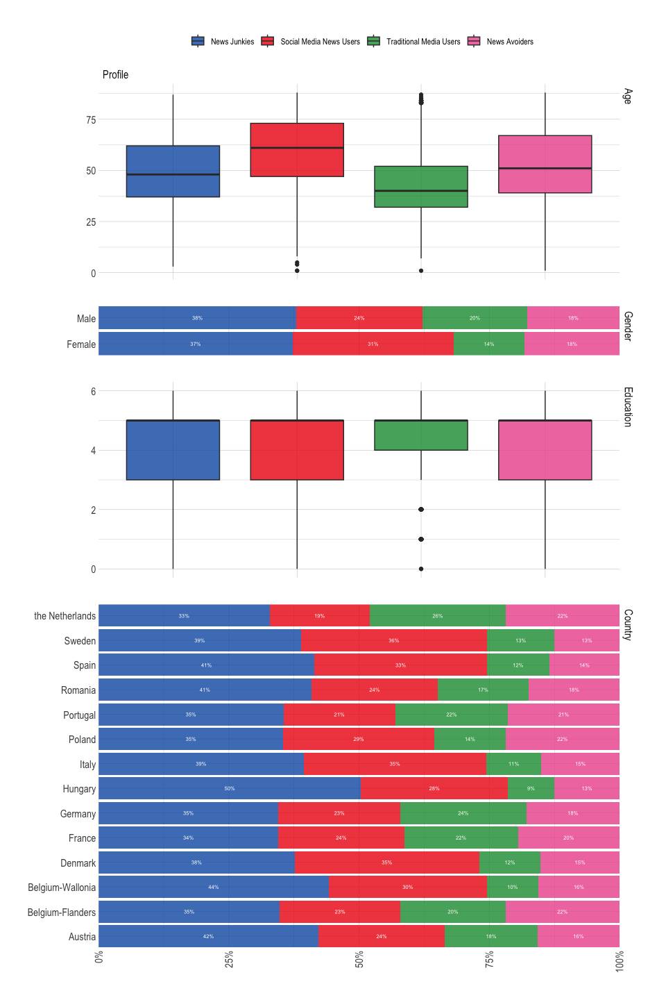
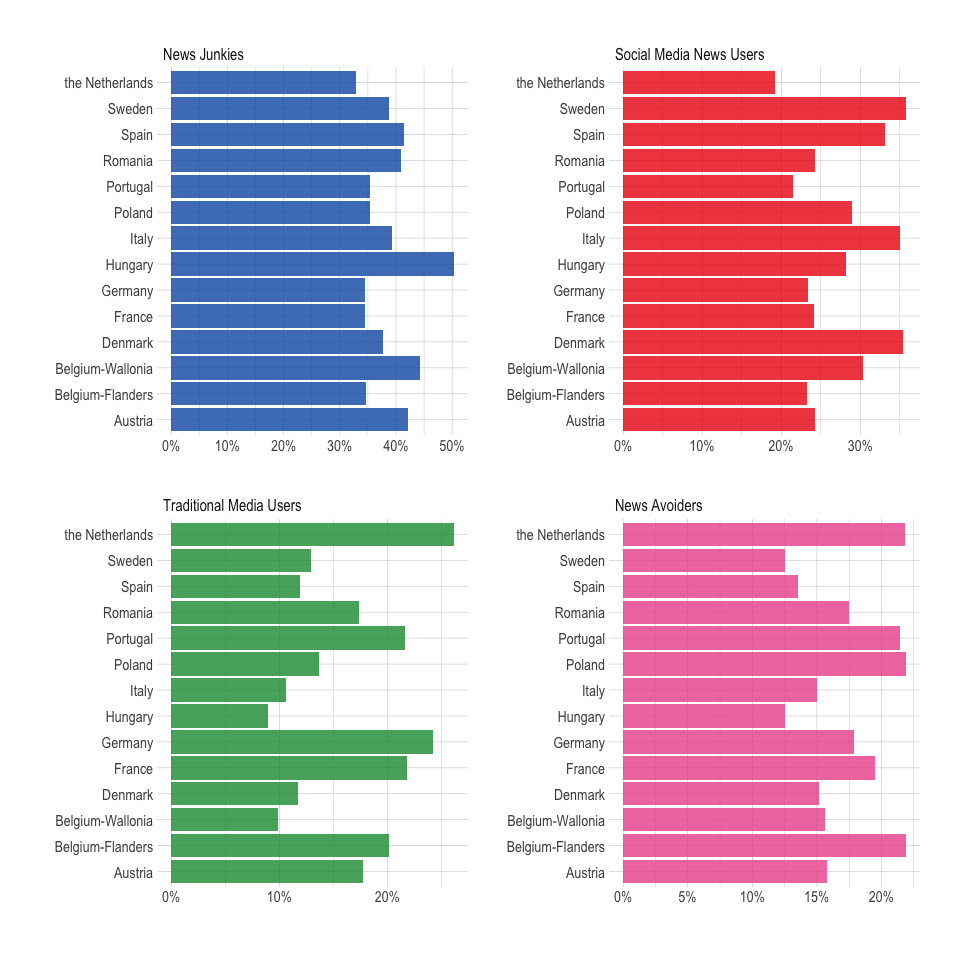
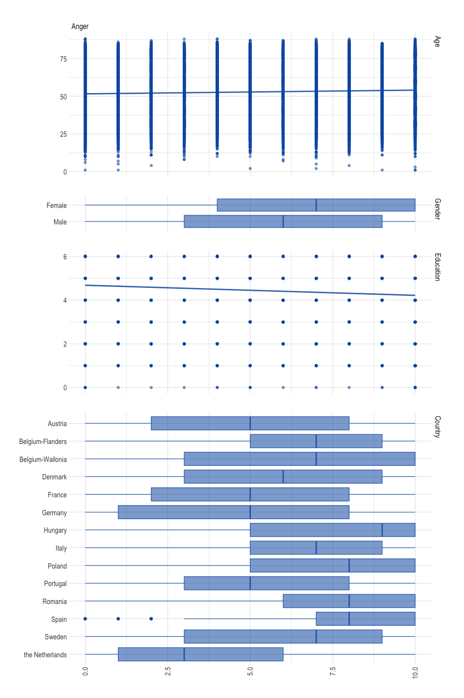
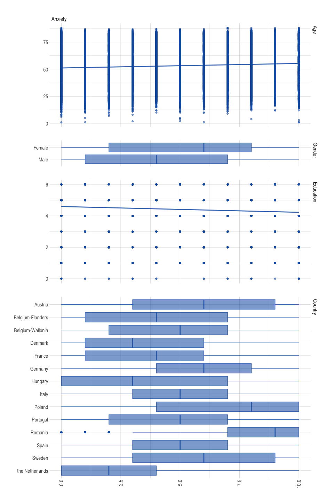
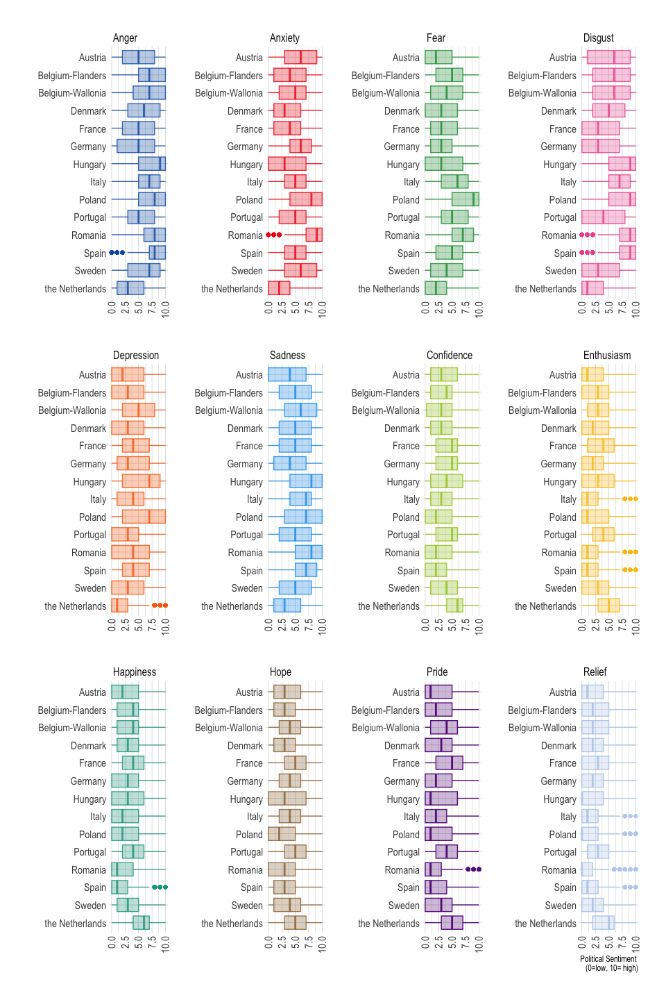
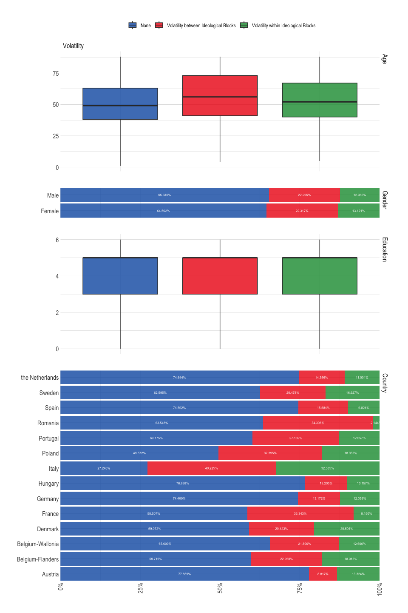
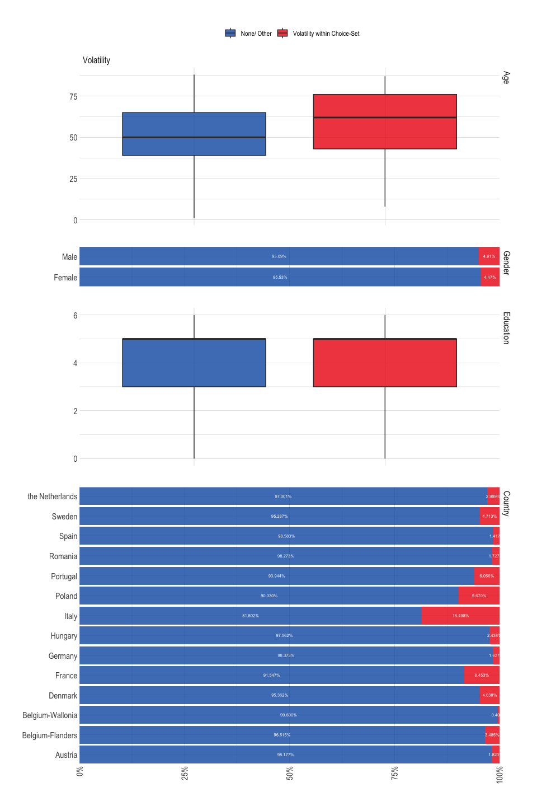
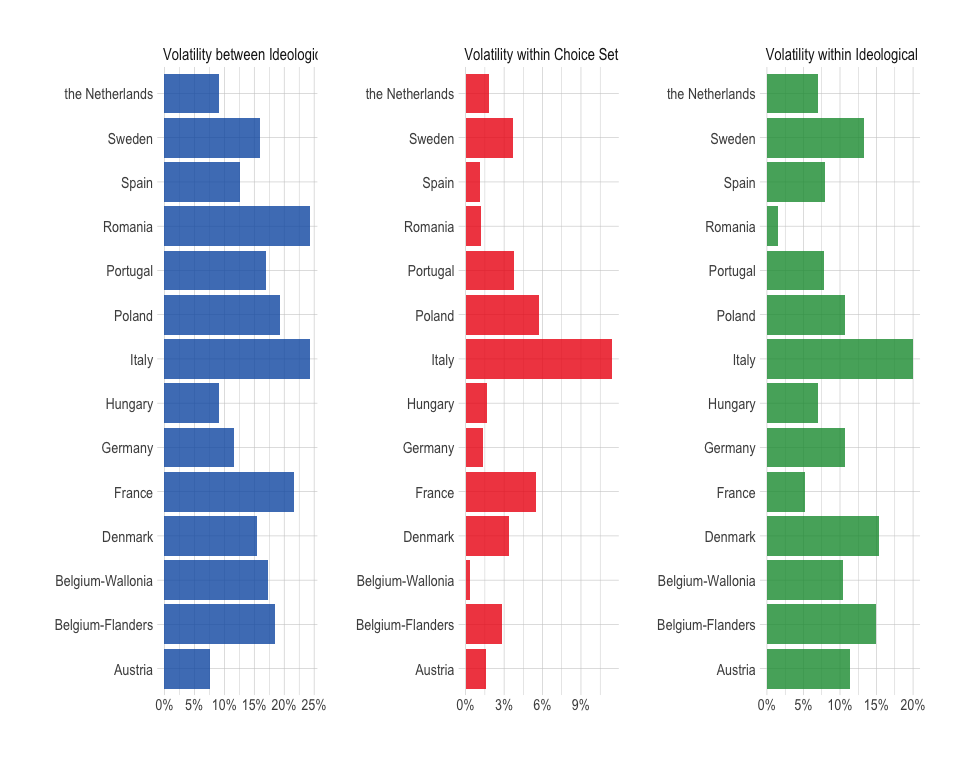

Prepare Data - S1
================

- [Required Packages &
  Reproducibility](#required-packages--reproducibility)
- [Tidy Data](#tidy-data)
- [Construction of variabeles](#construction-of-variabeles)
  - [Sociale Media Usage (I1_5)](#sociale-media-usage-i1_5)
  - [Political Sentiment](#political-sentiment)
  - [Volatility](#volatility)
- [Data Description](#data-description)
  - [Sociale Media Use](#sociale-media-use)
  - [Political Sentiment](#political-sentiment-1)
  - [Volatility](#volatility-1)

## Required Packages & Reproducibility

``` r
rm(list=ls())
source(here::here("src/lib/functions.R"))
#renv::snapshot()
```

## Tidy Data

``` r
source(here("src/data-processing/clean_eves.R"))
```

# Construction of variabeles

## Sociale Media Usage (I1_5)

Categories

1.  social media higher than average & other media higher than average
    (news junkies)
2.  social media higher than average & other media lower than average
    (SM news users)
3.  social media lower than average & other media higher than average
    (traditional news users)
4.  social media lower than average & other media lower than average
    (news avoiders)

## Political Sentiment

1.  Anxiety (0/1)
2.  Anger is constructed by respondents answering either Loathing or
    Distrust (0/1)

## Volatility

1.  Inter-block: change between vote choice and vote intention between
    the “blocks”
2.  Intra-block: change between vote choice and vote intention within
    the “block”
3.  choiceset: hange between vote choice and vote intention within
    choice set based on PTV

``` r
source(here("src/data-processing/party_harmonisation.R"))
```

    ## Connecting to Manifesto Project DB API... 
    ## Connecting to Manifesto Project DB API... corpus version: 2023-1

``` r
source(here("src/data-processing/operationalization_S1.R"))
save(d1, file = here("data/intermediate/cleaned_eves.RData"))
```

# Data Description

## Sociale Media Use

Who is in which category?

``` r
source(here("src/data-processing/descr_sm_s1.R"))
p1 
```



``` r
p2
```



``` r
rm(tmp, p1, p2, countries)
```

## Political Sentiment

Wich people experience what political sentiment?

``` r
source(here("src/data-processing/descr_emotion_s1.R"))
p1 #demografisch profiel obv woede 
```



``` r
p2 #demografisch profiel obv angst
```



``` r
p3 #political sentiment accross europe
```



``` r
rm(p1, p2, p3, tmp, fig_cols2)
```

## Volatility

Which people are in what category? (for all types of volatility
choice-set is overlapping with inter- or intra-block)

``` r
source(here("src/data-processing/descr_vol_s1.R"))
p1a #demografisch profiel obv intra /inter
```



``` r
p1b# #demografisch profielobv cs
```



``` r
p2  #volatiliteit door europa
```



``` r
rm(p1a, p1b, p2, countries, tmp)
```
