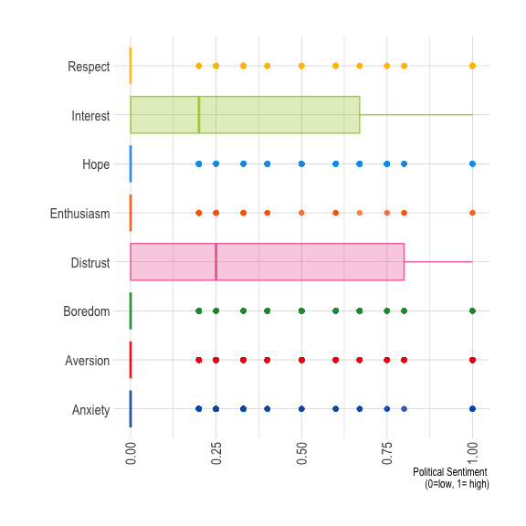
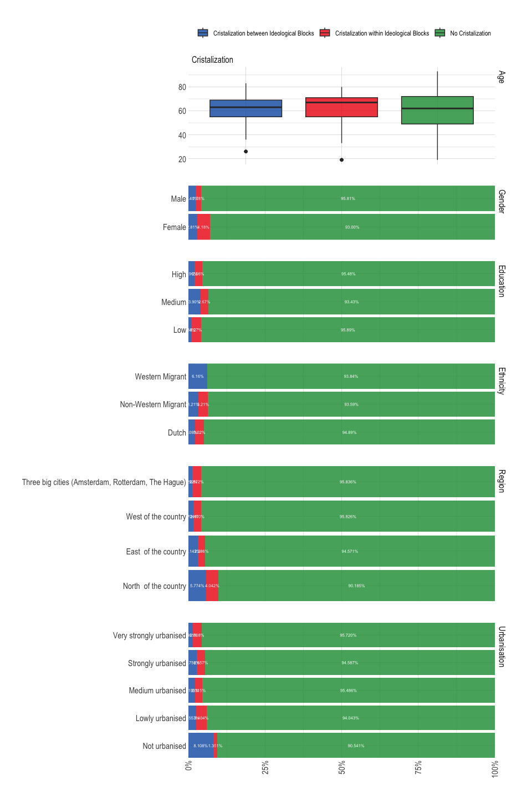

Prepare Data - S2
================

- [Required Packages &
  Reproducibility](#required-packages--reproducibility)
- [Tidy Data](#tidy-data)
- [Construction of variabeles](#construction-of-variabeles)
  - [Data](#data)
  - [Sociale Media Usage (I1_5)](#sociale-media-usage-i1_5)
  - [Political Sentiment](#political-sentiment)
  - [Volatility](#volatility)
- [Data Description](#data-description)
  - [Sociale Media Use](#sociale-media-use)
  - [Political Sentiment](#political-sentiment-1)
  - [Volatility](#volatility-1)

## Required Packages & Reproducibility

``` r
rm(list=ls())
source(here::here("src/lib/functions.R"))
#renv::snapshot()
```

## Tidy Data

``` r
source(here("src/data-processing/get_data.R"))
```

# Construction of variabeles

## Data

Filter data for resspondents that partipated `=< 3`.

``` r
n <- d %>% 
  group_by(id) %>% 
  count() %>% 
  filter(n>=3 & n<6) %>% 
  ungroup() 

d <- left_join(n, d, by = "id") %>% 
  select(-n)
```

## Sociale Media Usage (I1_5)

Categories

1.  social media higher than average & other media higher than average
    (news junkies)
2.  social media higher than average & other media lower than average
    (SM news users)
3.  social media lower than average & other media higher than average
    (traditional news users)
4.  social media lower than average & other media lower than average
    (news avoiders)

## Political Sentiment

1.  Anxiety (0/1)
2.  Anger is constructed by respondents answering either Loathing or
    Distrust (0/1)

## Volatility

Types:

1.  Conversion-inter: changing intention to vote w1-w4 (change during
    campaign ) between the “blocks”
2.  Conversion-intra: changing intention to vote w1-w4 (change during
    campaign ) within the “block”
3.  Conversion-choiceset: changing intention to vote w1-w4 (change
    during campaign ) within choice set based on PTV
4.  Cristalization-inter: change between vote choice (w5) and last vote
    intention between the “blocks”
5.  Cristalization-intra: change between vote choice (w5) and last vote
    intention within the “block”
6.  Cristalization-choiceset: change between vote choice (w5) and last
    vote intention within choice set based on PTV
7.  Consolidation-inter: change between vote choice 2021 and 2023
    between the “blocks”
8.  Consolidation-intra: change between vote choice 2021 and 2023 within
    the “block”
9.  Consolidation-choiceset: change between vote choice 2021 and 2023
    within choice set based on PTV

``` r
source(here("src/data-processing/operationalization_S2.R"))
save(df, file = here("data/intermediate/cleaned_data_allwaves.RData"))
rm(d)
```

# Data Description

## Sociale Media Use

Who is in which category?

``` r
source(here("src/data-processing/descr_sm_s2.R"))
p1 
```


``` r
p2 
```


``` r
p3
```


``` r
k1 <- p3
rm(p1, p2, p3, tmp)
```

## Political Sentiment

Wich people experience what political sentiment?

``` r
source(here("src/data-processing/descr_emotion_s2.R"))
p1
```



``` r
k2 <- as.list(p1)
rm(p1, tmp)
```

## Volatility

Which people are in what category? (for all types of volatilitym
choice-set is overlapping with inter- or intra-block)

``` r
source(here("src/data-processing/descr_vol_s2.R"))
p1 #demografisch profiel obv conversie 
```


``` r
p1b #demografisch profiel obv conversie (choice set)
```


``` r
p2 #profiel poltieke achtergrond obv conversie
```


``` r
p2b #profiel poltieke achtergrond obv conversie (choice set)
```


``` r
p3 #profiel poltieke achtergrond obv kristalisatie
```



``` r
p3b #profiel poltieke achtergrond obv kristalisatie (choice set)
```


``` r
p4 #profiel poltieke achtergrond obv kristalisatie
```


``` r
p4b #profiel poltieke achtergrond obv kristalisatie (choice set)
```


``` r
p5 #profiel poltieke achtergrond obv versteviging
```


``` r
p5b #profiel poltieke achtergrond obv versteviging (choice set)
```


``` r
p6 #profiel poltieke achtergrond obv versteviging
```


``` r
p6b #profiel poltieke achtergrond obv versteviging (choice set)
```


``` r
p7
```


``` r
k3 <- p7

kableExtra::kbl(tab, booktabs =T, caption = "\\label{tab:conditions} # Respondents per Volatility Category") %>%
  kableExtra::kable_styling(latex_options = c("striped", "hold_position"),
                full_width = F, fixed_thead = T, position = "center") %>%
  kableExtra::column_spec(1, width = "8cm") %>%
  kableExtra::column_spec(2, width = "2cm")
```

<table class="table" style="width: auto !important; margin-left: auto; margin-right: auto;">
<caption>
\# Respondents per Volatility Category
</caption>
<thead>
<tr>
<th style="text-align:left;position: sticky; top:0; background-color: #FFFFFF;">
Volatility
</th>
<th style="text-align:right;position: sticky; top:0; background-color: #FFFFFF;">
n
</th>
</tr>
</thead>
<tbody>
<tr>
<td style="text-align:left;width: 8cm; ">
Conversion between Ideological Blocks
</td>
<td style="text-align:right;width: 2cm; ">
805
</td>
</tr>
<tr>
<td style="text-align:left;width: 8cm; ">
Conversion within Ideological Blocks
</td>
<td style="text-align:right;width: 2cm; ">
275
</td>
</tr>
<tr>
<td style="text-align:left;width: 8cm; ">
No Conversion
</td>
<td style="text-align:right;width: 2cm; ">
7446
</td>
</tr>
<tr>
<td style="text-align:left;width: 8cm; ">
Conversion within Choice-Set
</td>
<td style="text-align:right;width: 2cm; ">
805
</td>
</tr>
<tr>
<td style="text-align:left;width: 8cm; ">
Cristalization between Ideological Blocks
</td>
<td style="text-align:right;width: 2cm; ">
230
</td>
</tr>
<tr>
<td style="text-align:left;width: 8cm; ">
Cristalization within Ideological Blocks
</td>
<td style="text-align:right;width: 2cm; ">
210
</td>
</tr>
<tr>
<td style="text-align:left;width: 8cm; ">
No Cristalization
</td>
<td style="text-align:right;width: 2cm; ">
8086
</td>
</tr>
<tr>
<td style="text-align:left;width: 8cm; ">
Cristalization within Choice-Set
</td>
<td style="text-align:right;width: 2cm; ">
210
</td>
</tr>
<tr>
<td style="text-align:left;width: 8cm; ">
Consolidation between Ideological Blocks
</td>
<td style="text-align:right;width: 2cm; ">
770
</td>
</tr>
<tr>
<td style="text-align:left;width: 8cm; ">
Consolidation within Ideological Blocks
</td>
<td style="text-align:right;width: 2cm; ">
515
</td>
</tr>
<tr>
<td style="text-align:left;width: 8cm; ">
No Consolidation
</td>
<td style="text-align:right;width: 2cm; ">
7241
</td>
</tr>
<tr>
<td style="text-align:left;width: 8cm; ">
Consolidation within Choice-Set
</td>
<td style="text-align:right;width: 2cm; ">
515
</td>
</tr>
</tbody>
</table>

``` r
rm(p1, p2, p3, p4, p5, p6, p7, p1b, p2b, p3b, p4b, p5b, p6b, tmp, tab)
```

``` r
k1 + as.list(k2) + k3
```


``` r
rm(k1, k2, k3)
```
